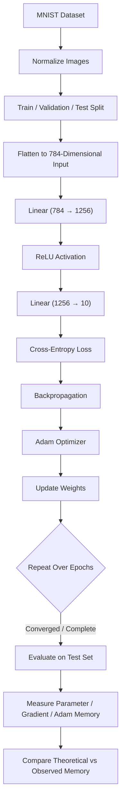

# Assignment Rules & Execution Plan: ADAM Optimizer & Memory Analysis

This document defines the architecture, pipeline workflow, training specifications, and theoretical vs. empirical memory profiling rules for the **ADAM Optimizer Assignment**.

---

## 1. Pipeline Overview

---

## 2. Dataset Rules & Specifications

1. **Dataset**: Standard MNIST handwritten digits dataset (60,000 training samples, 10,000 testing samples; $28 \times 28$ grayscale pixels, 10 classes: 0–9).
2. **Normalization**:
   - Rescale pixel intensity from integer range $[0, 255]$ to floating-point range $[0.0, 1.0]$.
   - Optionally apply standard MNIST normalization: $\mu = 0.1307$, $\sigma = 0.3081$.
3. **Splits**:
   - Training Set: 50,000 images.
   - Validation Set: 10,000 images (held out from the original 60,000 train set for hyperparameter tuning / early stopping).
   - Test Set: 10,000 images (evaluated once at the end).
4. **Data Loading**:
   - Mini-batching (recommended batch size: $64$ or $128$).
   - Training split must be shuffled each epoch; validation and test splits must remain fixed and un-shuffled.

---

## 3. Model Architecture Rules

The neural network must be implemented as a Multilayer Perceptron (MLP) with the following structure:

| Layer | Type | Input Dimension | Output Dimension | Activation | Parameter Count |
| :--- | :--- | :--- | :--- | :--- | :--- |
| **Input** | Flatten | $1 \times 28 \times 28$ | $784$ | None | $0$ |
| **Layer 1** | Linear | $784$ | $1256$ | ReLU | $W_1: 784 \times 1256$, $b_1: 1256$ |
| **Activation** | ReLU | $1256$ | $1256$ | $\max(0, x)$ | $0$ |
| **Layer 2** | Linear | $1256$ | $10$ | None (Logits) | $W_2: 1256 \times 10$, $b_2: 10$ |

### Exact Parameter Count Calculation:
- **Layer 1 (Linear)**:
  - Weights: $784 \times 1256 = 984,704$
  - Biases: $1256$
  - Subtotal: $985,960$
- **Layer 2 (Linear)**:
  - Weights: $1256 \times 10 = 12,560$
  - Biases: $10$
  - Subtotal: $12,570$
- **Total Parameters ($N$)**:
  $$\mathbf{N = 985,960 + 12,570 = 998,530 \text{ parameters}}$$

---

## 4. Loss, Optimization & Training Rules

1. **Loss Function**:
   - Categorical Cross-Entropy Loss (`nn.CrossEntropyLoss` in PyTorch).
   - Input: Raw unnormalized logits from Layer 2.
   - Target: Ground truth integer class labels $\{0, 1, \dots, 9\}$.
2. **Backpropagation**:
   - Compute gradients $\nabla_\theta \mathcal{L}$ for all model parameters via reverse-mode automatic differentiation.
3. **Adam Optimizer (`torch.optim.Adam`)**:
   - Standard hyperparameter values:
     - Learning rate $\alpha = 10^{-3}$ (or tune as appropriate)
     - $\beta_1 = 0.9$
     - $\beta_2 = 0.999$
     - $\epsilon = 10^{-8}$
   - Update Equations:
     $$m_t = \beta_1 m_{t-1} + (1 - \beta_1) g_t$$
     $$v_t = \beta_2 v_{t-1} + (1 - \beta_2) g_t^2$$
     $$\hat{m}_t = \frac{m_t}{1 - \beta_1^t}, \quad \hat{v}_t = \frac{v_t}{1 - \beta_2^t}$$
     $$\theta_t = \theta_{t-1} - \frac{\alpha}{\sqrt{\hat{v}_t} + \epsilon} \hat{m}_t$$
4. **Training Loop**:
   - Iterate over predetermined epochs (e.g., $10$ to $20$).
   - Record training loss, training accuracy, validation loss, and validation accuracy at each epoch.
5. **Final Evaluation**:
   - Evaluate model on the unseen test set.
   - Report final test loss and classification accuracy.

---

## 5. Memory Profiling Rules: Theoretical vs. Observed

A critical requirement of this assignment is calculating theoretical memory and comparing it against empirical measurements.

Assuming single-precision floating point (**FP32**, 4 bytes per element):

### 5.1 Theoretical Memory Calculations

| Component | Number of Values | Bytes per Value | Theoretical Memory (Bytes) | Theoretical Memory (MB / MiB) |
| :--- | :--- | :--- | :--- | :--- |
| **Model Parameters ($\theta$)** | $998,530$ | $4$ | $3,994,120\text{ B}$ | $\approx 3.99\text{ MB}$ ($3.809\text{ MiB}$) |
| **Gradients ($\nabla_\theta$)** | $998,530$ | $4$ | $3,994,120\text{ B}$ | $\approx 3.99\text{ MB}$ ($3.809\text{ MiB}$) |
| **Adam 1st Moment Buffer ($m$)** | $998,530$ | $4$ | $3,994,120\text{ B}$ | $\approx 3.99\text{ MB}$ ($3.809\text{ MiB}$) |
| **Adam 2nd Moment Buffer ($v$)** | $998,530$ | $4$ | $3,994,120\text{ B}$ | $\approx 3.99\text{ MB}$ ($3.809\text{ MiB}$) |
| **Total Adam Optimizer State** | $2 \times 998,530$ | $4$ | $7,988,240\text{ B}$ | $\approx 7.99\text{ MB}$ ($7.618\text{ MiB}$) |
| **Total Static Training State** | $4 \times 998,530$ | $4$ | **$15,976,480\text{ B}$** | **$\approx 15.98\text{ MB}$ ($15.236\text{ MiB}$)** |

> **Key Rule**: Adam requires **2 state tensors** per trainable parameter ($m$ and $v$), meaning the optimizer states consume **twice the memory of the model parameters themselves**, and the total static state (Parameters + Gradients + Adam states) consumes **$16$ bytes per parameter** in FP32.

### 5.2 Observed Memory Measurement Rules

1. **Device Isolation**:
   - If running on **CUDA (GPU)**:
     - Use `torch.cuda.reset_peak_memory_stats()`.
     - Query `torch.cuda.memory_allocated()` at key checkpoints:
       1. Baseline (before loading model)
       2. After `model.to(device)` (Parameters)
       3. After `loss.backward()` (Parameters + Gradients)
       4. After `optimizer.step()` (Parameters + Gradients + Optimizer States)
     - Use `torch.cuda.max_memory_allocated()` to capture peak memory including forward activations.
   - If running on **CPU**:
     - Profile optimizer state dict memory using `sys.getsizeof` / tensor element size checks on `optimizer.state_dict()['state']`.
     - Or use Python memory profilers (e.g. `tracemalloc`, `psutil`).

2. **Reconciliation & Comparison**:
   - Compare theoretical predictions against observed values.
   - Account for discrepancies:
     - Activation tensors stored for backward pass (batch size $\times$ layer activations).
     - PyTorch tensor metadata overhead / memory caching allocator block alignments.
     - Temporary buffers created during arithmetic operations in Adam step.
